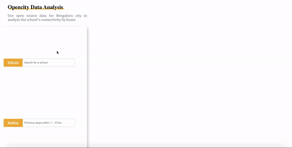

# Activity Tracker

[Visit Live Link here](https://schools-connectivity-data-viz-react.vercel.app/)

A single page appliction built using OpenCity's schools and bus stops data for Bengaluru city to analyse the connectivity of schools across Bengaluru.

## Features

- Enter first three characters of a school for example: GKL 
- A dropdown of auto complete school list shall be displayed
- Pick one and enter radius as a number between 1 to 10. This represents radius in km
- A backend query shall be executed with the school coordinate and radius that will fetch the bus stops falling in that region
- react-map-gl will load the Mapbox where school is represented by an Orange icon and bus stops are represented by blue icons.
- Also, a scrollable list of bus stops will be displayed on the top.
- Clicking on any bus stop from the card shall zoom in on that particular bus stop in the map.
- Hover on any of the bus stop marker or school marker shall display a pop over with its name.

## Technologies

- React JS
- Styled Components
- react-map-gl
- Mapbox
- MongoDB geojson queries
- Express JS
- Material UI for icons
- React spinners for loading

## Local Setup

1. Clone the repository
2. `npm install`
3. `npm start`
4. You can check the working app on localhost:3000
